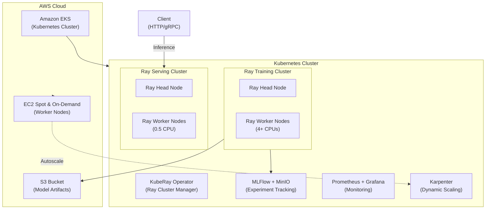

# Sentinel AI Platform

An Enterprise-Grade MLOps Platform for Distributed Training & Serving on Kubernetes.

## Overview

Sentinel is an end-to-end AI Infrastructure Platform designed to demonstrate how to architect, deploy, and scale machine learning workloads in a cloud-native environment.

It solves the "Day 2" challenges of AI engineering:

- **Unified Compute:** Runs Training, Tuning, and Serving on a single KubeRay cluster.
- **FinOps:** Leverages Karpenter and EC2 Spot Instances to reduce compute costs by up to 90%.
- **Reliability:** Implements Zero-Downtime rolling updates and traffic-based autoscaling.
- **Observability:** Full visibility into GPU/CPU metrics via Prometheus and Grafana.

## System Architecture

The platform runs on Amazon EKS, orchestrating Ray clusters via the KubeRay Operator. It separates concerns into distinct planes for Data, Compute, and Observability.



## Key Features

1. Distributed Training & Tuning

- Frameworks: PyTorch Lightning + Ray Train.
- Optimization: Hyperparameter tuning using Ray Tune (ASHA Scheduler) to find the best model configuration with minimal compute waste.
- Tracking: All metrics (Loss, Accuracy) are automatically logged to a self-hosted MLflow instance backed by S3/MinIO.

2. Production Serving (Inference)

- Engine: Ray Serve provides a high-performance HTTP gateway.
- Scalability: Configured with Horizontal Autoscaling (1-5 replicas) based on request queue depth.
- Zero-Downtime: Updates use a rolling deployment strategy managed by the RayService CRD.

3. FinOps & Cost Optimization

- Spot Instances: Worker nodes run on AWS Spot Instances (g4dn / g5 series), managed by Karpenter.
- Scale-to-Zero: Training clusters spin down completely when idle.
- Node Affinity: Strict nodeSelector rules ensure expensive GPU nodes are only provisioned for ML workloads, not system pods.

## Tech Stack
* **Orchestration:** Kubernetes (Kind/EKS)
* **Compute Framework:** KubeRay (Ray Cluster)
* **Registry:** MLflow
* **Observability** Prometheus, Grafana

## Getting started

## Prerequisites

- AWS CLI & kubectl configured
- Terraform installed
- Helm installed

### Create kubernetes cluster

bin/setup_kind.sh

### Install kuberay

bin/install-ray.sh

### create sentinel service

bin/create-service.sh

### Open Ray Dashboard

```bash
kubectl port-forward svc/sentinel-service-head-svc 8265:8265
```

Browser: http://localhost:8265/

### Inference

```bash
kubectl port-forward service/sentinel-service-head-svc 8000:8000
```

Curl

```bash
curl -X POST http://localhost:8000/predict \
-H "Content-Type: application/json" \
-d '{"text": "Ray Serve is amazing!"}'
```

### Submit training job

To upload the local train/train_job.py to the cluster, use `--working-dir`, otherwise, ray assume the file exists

```bash
ray job submit \
  --working-dir . \
  --runtime-env-json='{"pip": ["transformers", "datasets", "evaluate", "scikit-learn", "mlflow", "torch", "psycopg2-binary", "accelerate"], "env_vars": {"MLFLOW_TRACKING_URI": "http://mlflow:5000"}}' \
  -- python jobs/train/train_job.py
```

## Production in EKS

### Install ekscli


homebrew

```
brew tap aws/tap
brew install aws/tap/eksctl
```

### Create an EKS cluster

```
eksctl create cluster -f eks/cluster.yaml --with-oidc
```

### create a namespace

```bash
kubectl create namespace sentinel-prod
```

### Tag the subnets, so eks can place the loadbalancer

```
--tags Key=kubernetes.io/role/elb,Value=1
```

### Create s3 bucket for artefacts

```bash
aws s3 mb s3://training-artifacts-du-yuyang --region ap-southeast-2
```

### Create the iam policy

```bash
aws iam create-policy --policy-name SentinelS3Access --policy-document file://aws/s3-policy.json
```

output: arn:aws:iam::669382012465:policy/SentinelS3Access

### Create IAM role with s3 policy, create k8s service account to annotated with the IAM role

```bash
# associate the IODC
eksctl utils associate-iam-oidc-provider \
  --region=ap-southeast-2 \
  --cluster=du-yuyang-training \
  --approve


eksctl create iamserviceaccount \
  --name ray-service-account \
  --namespace sentinel-prod \
  --cluster du-yuyang-training \
  --attach-policy-arn arn:aws:iam::669382012465:policy/SentinelS3Access \
  --approve
```

### Create kuberay operator

bin/kuberay-operator.sh


### Create monitoring

bin/prometheus.sh


## Training cluster

```bash
kubectl apply -f k8s/ray/ray-cluster-train.yaml

# to access the dashboard
kubectl port-forward svc/sentinel-training-cluster-head-svc 8265:8265 -n sentinel-prod

# http://localhost:8265

# Submit the job
ray job submit --address http://localhost:8265 \
  --working-dir . \
  -- python jobs/train/train_dummy.py
```


## Serve

```bash

# the serve
kubectl apply -f k8s/ray/ray-factcheck-serve.yaml
## The service + Load balancer

# Test
curl -X POST http://a2d3de443c49f47c48ff1475aaeca917-6ce7217cf7820bbe.elb.ap-southeast-2.amazonaws.com:8000/check \
  -H "Content-Type: application/json" \
  -d '{
    "query": "This property has 2 bedrooms and a pool.",
    "facts": {
        "bedrooms": 2,
        "pool": true
    }
  }'
```

## Add node group to eks cluster

```bash
eksctl create nodegroup --config-file=cluster.yaml --include=worker-group-spot-1
```

## Cluster autoscaling

```bash
kubectl apply -f k8s/scaler/cluster-autoscaler.yaml

# check the logs
kubectl logs -f deployment/cluster-autoscaler -n kube-system

# if error, edit
kubectl edit clusterrole cluster-autoscaler

# restart the pod
kubectl delete pod -n kube-system -l app=cluster-autoscaler
```

## Train/Tune/Serve recommend model

The Architecture:

- Compute: Kubernetes (EKS) with KubeRay for orchestration.
- Model: PyTorch Matrix Factorization (trained via Ray Train, tuned via Ray Tune).
- Serving: Ray Serve for high-throughput inference behind an AWS NLB.
- Infrastructure: IAM-integrated security (no hardcoded keys) and Docker-based immutable deployments.

```bash
# Ask for predictions
curl -X POST http://a62d0fc501b8743ca8f2ec0d334108a0-a0eec30244505014.elb.ap-southeast-2.amazonaws.com:8000/recommend \
  -H "Content-Type: application/json" \
  -d '{ "user_id": 42, "movie_ids": [100, 200, 300] }'
```

## Clean the eks cluster

Scale down the workers

```bash
eksctl scale nodegroup --cluster du-yuyang-training --name managed-ng-1 --nodes 0 --nodes-min 0 --nodes-max 1

eksctl scale nodegroup --cluster du-yuyang-training --name worker-group-spot-1 --nodes 0 --nodes-min 0 --nodes-max 1

# 1. Turn off CoreDNS (The main blocker)
kubectl scale deployment coredns -n kube-system --replicas=0

# 2. Turn off Metrics Server (Just in case)
kubectl scale deployment metrics-server -n kube-system --replicas=0
```


Delete the cluster

```bash
kubectl delete svc sentinel-service-serve-svc -n sentinel-prod
eksctl delete cluster -f eks/cluster.yaml
```

## Scale up, DNS

```bash
# "The Wake Up Sequence"
eksctl scale nodegroup --cluster du-yuyang-training --name managed-ng-1 --nodes 2 --nodes-min 2
# Wait for nodes to be Ready, then:
kubectl scale deployment coredns -n kube-system --replicas=2
kubectl scale deployment metrics-server -n kube-system --replicas=1
```
