# Sentinel Platform Architecture

Sentinel is an end-to-end **AI Infrastructure Platform** demonstrating distributed machine learning on Kubernetes. This document outlines the system components, data flow, and deployment topology.

---

## System Overview

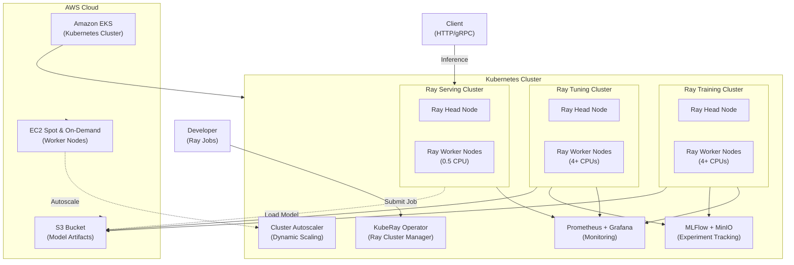

---

## Component Architecture

### 1. Infrastructure Layer (EKS & Kubernetes)

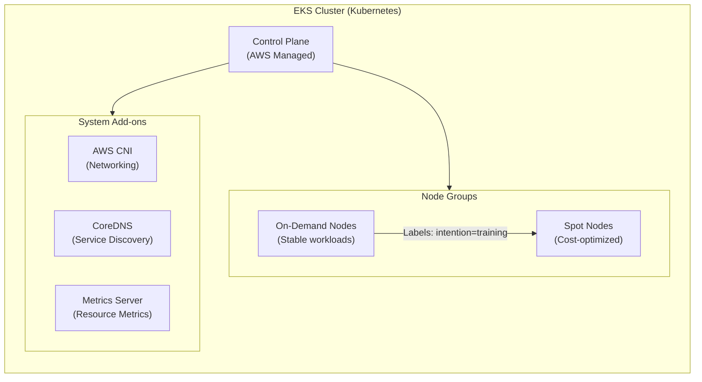

**Key Infrastructure Decisions:**
- **EKS**: Managed Kubernetes on AWS
- **Node Types**:
  - On-Demand: For critical services (head nodes, control plane)
  - Spot: For worker nodes (80% cost savings)
- **Node Selector Strategy**: `intention=training` and `lifecycle=Ec2Spot` labels for workload affinity
- **Cluster Autoscaler**: Dynamically scales node groups based on pending pod requests

---

### 2. KubeRay Operator & Ray Clusters

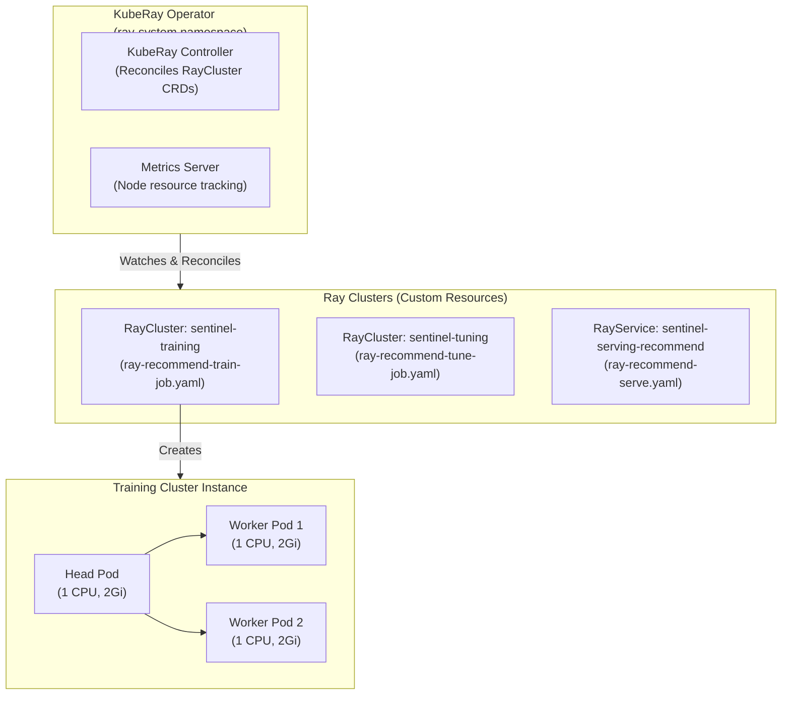

**Ray Cluster Components:**
- **Head Node**: Scheduler, object store, dashboard (port 8265), HTTP gateway (port 8000)
- **Worker Nodes**: Execute tasks and store distributed objects
- **RayCluster CRD**: Kubernetes Custom Resource defining cluster topology
- **RayService CRD**: Wraps RayCluster + Ray Serve deployments (auto health checks)

---

### 3. Machine Learning Pipeline

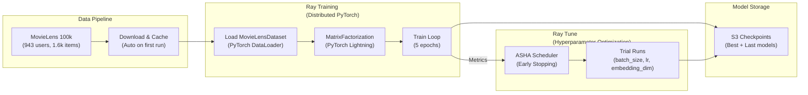

**Pipeline Stages:**
1. **Data Ingestion**: MovieLens 100k automatically downloaded on first run
2. **Training**: Distributed PyTorch via Ray Train + Lightning
3. **Hyperparameter Tuning**: Ray Tune with ASHA early stopping (~80% compute savings)
4. **Artifact Storage**: Checkpoints saved to S3 for reproducibility

---

### 4. Serving Layer (Ray Serve)

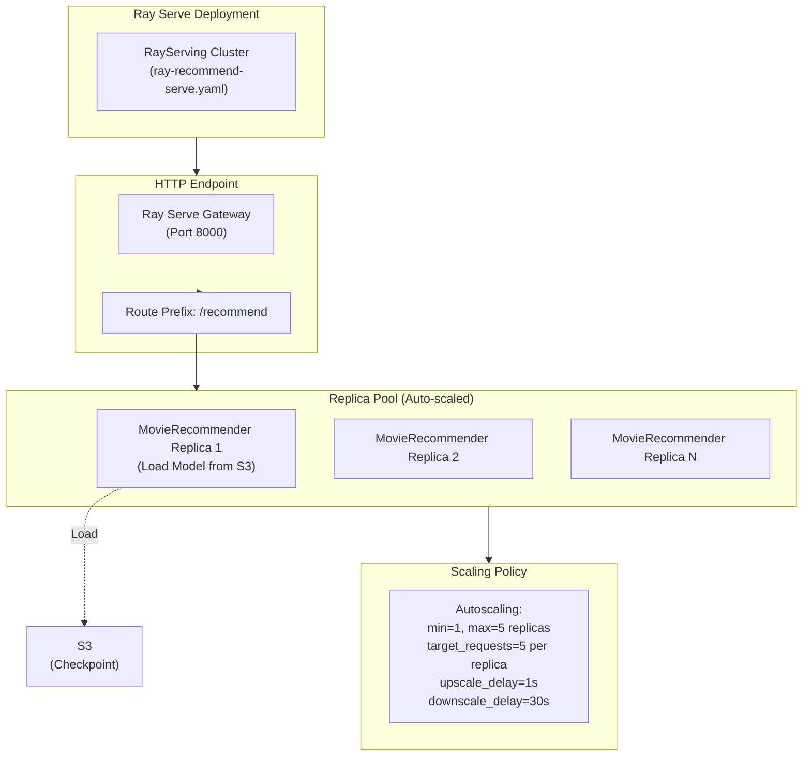

**Serving Features:**
- **HTTP Gateway**: TensorFlow Serving-style REST API
- **Auto-scaling**: Policies scale replicas 1-5 based on pending request queue
- **Lazy Loading**: Models downloaded from S3 on pod startup
- **Stateless**: Each replica is independent; easy horizontal scaling

---

### 5. Monitoring & Observability

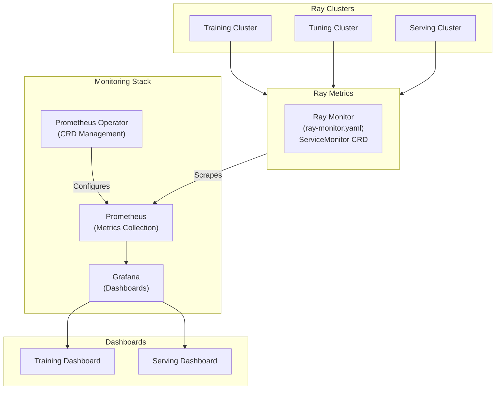

**Monitoring Components:**
- **Prometheus**: Scrapes Ray metrics (CPU, memory, task queue length)
- **Grafana**: Visualizes training progress and serving load
- **ServiceMonitor**: Kubernetes-native Prometheus scrape configuration
- **Ray Metrics**: Built-in Ray metrics exporters for all clusters

---

## Deployment Manifests Reference

### 1. **bin/kuberay-operator.sh**
Installs KubeRay operator and metrics server:
```bash
helm install kuberay-operator kuberay/kuberay-operator --version 1.5.1
helm install metrics-server metrics-server/metrics-server --version 3.13.0
```

### 2. **bin/custom-image.sh**
Builds and pushes Docker images:
- `Dockerfile.serve`: Ray Serve runtime with model inference code
- `Dockerfile.train`: Ray Train runtime with PyTorch Lightning

### 3. **bin/prometheus.sh**
Installs Prometheus stack and configures Ray scraping:
```bash
helm install prometheus prometheus-community/kube-prometheus-stack
kubectl apply -f k8s/ray-monitor.yaml
```

---

## Kubernetes Manifests

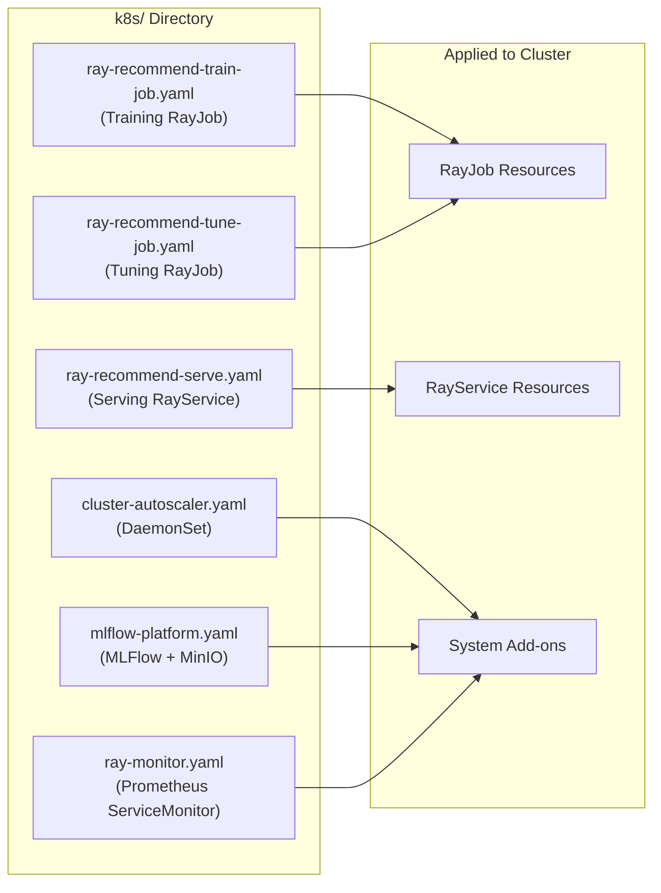

---

## Data Flow Diagram

### Training & Tuning Pipeline
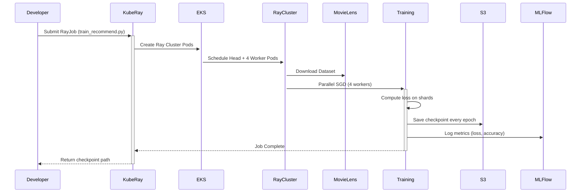

### Serving Request Flow
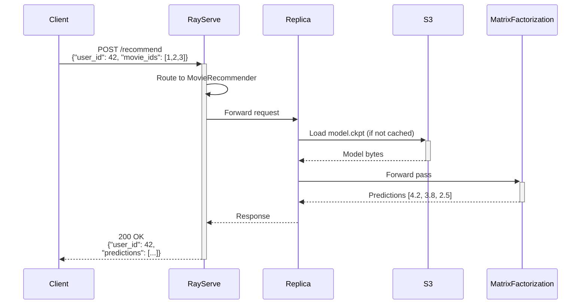

---

## Scaling Strategy

### Horizontal Scaling (Replicas)

| Scenario | Config | Behavior |
|----------|--------|----------|
| Low traffic (0-5 req/s) | min_replicas=1 | Single replica handles all requests |
| Medium traffic (5-25 req/s) | max_replicas=5 | Scale to 5 replicas (1 req per replica) |
| Traffic spike | upscale_delay_s=1 | Add replicas within 1 second |
| Traffic drop | downscale_delay_s=30 | Remove unused replicas after 30s idle |

### Vertical Scaling (Node Capacity)

| Component | CPU/Pod | Memory/Pod | Purpose |
|-----------|---------|-----------|---------|
| Head Node | 0.5-1.0 | 2Gi | Scheduling, dashboard, object store |
| Training Worker | 1.0 | 2Gi | Distributed SGD computation |
| Serving Worker | 0.5 | 2Gi | Model inference (lightweight) |

### Node Group Scaling (Cluster Autoscaler)

```
Pending Pod detected
  ↓
Cluster Autoscaler checks available nodes
  ↓
No capacity? → Scale up node group (EC2 Spot/On-Demand)
  ↓
Node ready → Kubelet schedules pod
```

---

## Security & IAM

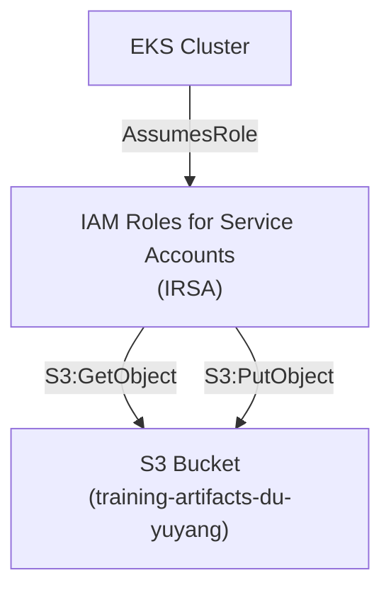

**IAM Permissions:**
- Ray Serve pods assume IAM role → download models from S3
- Training pods assume IAM role → write checkpoints to S3
- Principle: Least privilege (S3 bucket-scoped, not wildcard)

---

## Networking

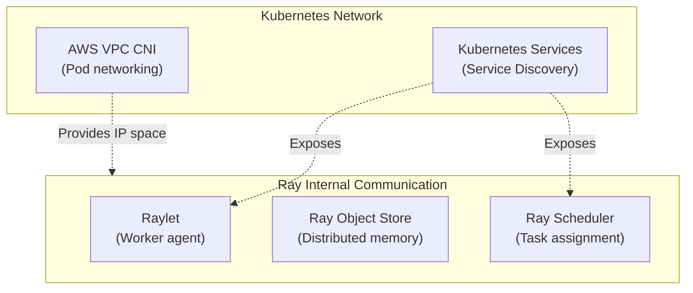

**Network Design:**
- **AWS CNI**: Each pod gets IP from VPC subnets
- **Ray Raylet**: Inter-pod communication on custom ports
- **Object Store**: Redis-backed distributed shared memory
- **Service Mesh** (optional): Could add Istio for traffic splitting

---

## Development Workflow

```mermaid
graph LR
    Dev["Developer<br/>(Local Machine)"]
    
    subgraph Local["Local Development"]
        Code["Python Code<br/>(train_recommend.py)"]
        Test["Unit Tests"]
        Mock["Mock Ray Cluster"]
    end
    
    subgraph CI["CI/CD Pipeline<br/>(GitHub Actions)"]
        Build["Build Docker Image"]
        Scan["Security Scan"]
        Push["Push to ECR"]
    end
    
    subgraph Staging["Staging Cluster<br/>(kind or EKS)"]
        Deploy["kubectl apply<br/>-f k8s/"]
        Validate["Run Integration Tests"]
    end
    
    subgraph Prod["Production Cluster<br/>(EKS)"]
        Submit["kubectl apply<br/>-f k8s/"]
        Monitor["Prometheus Dashboards"]
    end
    
    Dev -->|Write & Test| Local
    Local -->|Git Push| CI
    CI -->|Image| Staging
    Staging -->|Promote| Prod
    Prod -->|Monitor| Monitor

```

---

## Troubleshooting Checklist

### Pod Scheduling Issues
```
❌ "0/4 nodes are available: Insufficient cpu"
✅ Solutions:
  - Reduce CPU requests (e.g., 1.0 → 0.5)
  - Scale node group (cluster autoscaler)
  - Check node selector constraints

❌ "Pod didn't match node affinity/selector"
✅ Solutions:
  - Verify node labels: kubectl get nodes --show-labels
  - Check nodeSelector/affinity in manifest
  - Add labels to nodes: kubectl label nodes...
```

### Model Loading Failures
```
❌ "S3 access denied"
✅ Solutions:
  - Verify IRSA permissions
  - Check S3 bucket policy
  - Ensure checkpoint path is correct

❌ "Model not found at s3://..."
✅ Solutions:
  - List S3 checkpoints: aws s3 ls s3://training-artifacts-du-yuyang/
  - Update RayService manifest with correct path
```

### Monitoring Issues
```
❌ "Prometheus not scraping Ray metrics"
✅ Solutions:
  - Check ServiceMonitor: kubectl get servicemonitor -n monitoring
  - Verify ray-monitor.yaml applied
  - Port-forward to check metrics: kubectl port-forward...
```

---

## References

- **KubeRay Docs**: https://docs.ray.io/en/latest/kuberay/index.html
- **Ray Train**: https://docs.ray.io/en/latest/train/train.html
- **Ray Serve**: https://docs.ray.io/en/latest/serve/index.html
- **Ray Tune**: https://docs.ray.io/en/latest/tune/index.html
- **EKS Best Practices**: https://aws.github.io/aws-eks-best-practices/

