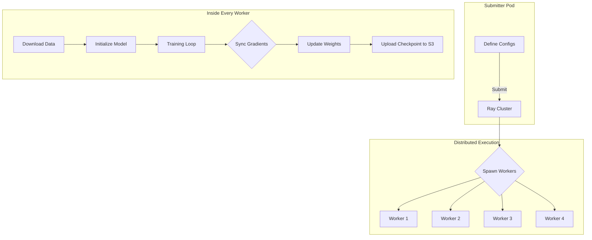

# workflow

```mermaid
graph TD
    subgraph Driver [Submitter Pod]
        A[Define Configs] -->|Submit| B[Ray Cluster]
    end

    subgraph RayCluster [Distributed Execution]
        B --> C{Spawn Workers}
        C --> W1[Worker 1]
        C --> W2[Worker 2]
        C --> W3[Worker 3]
        C --> W4[Worker 4]
    end

    subgraph WorkerProcess [Inside Every Worker]
        D[Download Data] --> E[Initialize Model]
        E --> F[Training Loop]
        F --> G{Sync Gradients}
        G --> H[Update Weights]
        H --> I[Upload Checkpoint to S3]
    end
```
